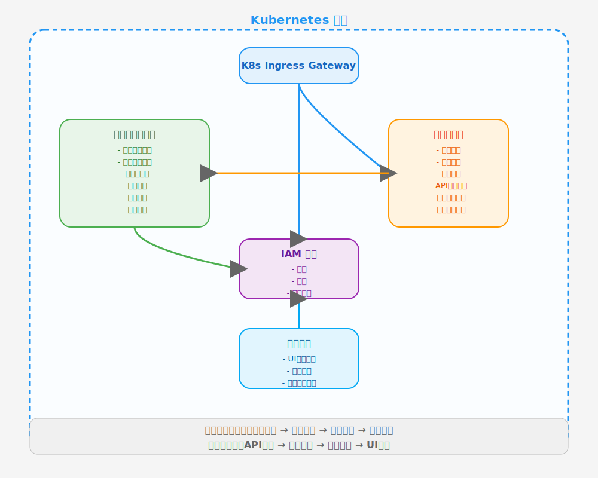
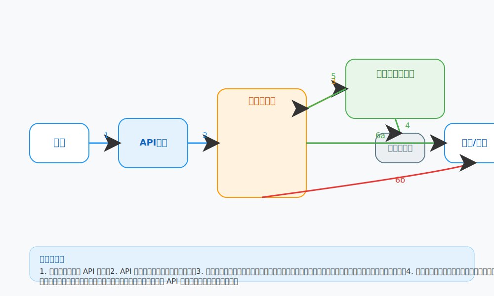

# 许可证管理系统与业务微服务/IAM 对接集成指南

> 本文档面向业务微服务开发人员，详细说明如何将许可证管理系统集成到微服务与IAM体系中，实现灵活的授权与合规控制。

---

## 1. 架构与流程概览

- 推荐先阅读架构图和工作流图：
  - 
  - 
- 主要流程：
  1. 用户请求经API网关进入业务微服务
  2. 微服务在处理前校验许可证（本地或远程）
  3. 校验通过则执行业务逻辑，否则直接拒绝
  4. 许可证管理系统可与IAM集成，实现用户/租户/角色级别的授权

---

## 2. 微服务集成许可证校验的最佳实践

### 2.1 本地校验（推荐，支持离线）

- 微服务部署时挂载公钥和许可证文件
- 在业务代码中集成 `license_validator`，每次请求前进行校验
- 适合对安全性和离线能力有要求的场景

**示例：**
```python
from license_validator import LicenseValidator
from fastapi import HTTPException

validator = LicenseValidator("/etc/license/public_key.pem")

# 装饰器方式
from functools import wraps

def require_license_api(method, path):
    def decorator(func):
        @wraps(func)
        def wrapper(*args, **kwargs):
            license_obj = ... # 从本地加载或缓存
            if not validator.check_api_permission(license_obj, method=method, path=path):
                raise HTTPException(status_code=403, detail="License check failed")
            return func(*args, **kwargs)
        return wrapper
    return decorator

# 用法
@app.post("/api/v1/users")
@require_license_api("POST", "/api/v1/users")
def create_user(...):
    ...
```

### 2.2 远程校验（适合动态授权/集中管理）

- 微服务通过HTTP请求调用许可证管理系统的校验API
- 适合许可证频繁变更、需要统一管理的场景

**示例：**
```python
import requests
from fastapi import HTTPException

def check_license_remote(method, path, token):
    resp = requests.post(
        "http://license-manager/api/check",
        json={"method": method, "path": path, "token": token}
    )
    if not resp.ok or not resp.json().get("allowed"):
        raise HTTPException(status_code=403, detail="License check failed")

@app.post("/api/v1/orders")
def create_order(...):
    check_license_remote("POST", "/api/v1/orders", user_token)
    ...
```

---

## 3. 与IAM的集成建议

- **用户/租户/角色信息与许可证绑定**：
  - 许可证可包含 `customer_id`、`tenant_id`、`user_id` 等字段
  - IAM系统在用户登录/鉴权时，将相关ID传递给微服务，微服务据此校验对应的许可证
- **典型集成方式**：
  - IAM颁发JWT，JWT中包含租户/用户信息
  - 微服务解析JWT，结合许可证做多维度校验
- **多租户场景**：
  - 每个租户可有独立许可证，微服务根据租户ID选择校验对象

---

## 4. 典型代码示例

### 4.1 API权限校验
```python
@app.get("/api/v1/data")
@require_license_api("GET", "/api/v1/data")
def get_data(...):
    ...
```

### 4.2 服务/按钮/用量权限校验
```python
# 服务权限
if not validator.check_service_permission(license_obj, service_name="order-service", endpoint="/orders"):
    raise HTTPException(status_code=403, detail="Service not allowed")

# 按钮权限
if not validator.check_button_permission(license_obj, button_id="export-btn"):
    ... # 隐藏或禁用按钮

# 用量限制
if not validator.check_usage_limit(license_obj, "users", 1):
    raise HTTPException(status_code=403, detail="User limit exceeded")
```

### 4.3 异常处理与日志
```python
try:
    ... # 校验逻辑
except Exception as e:
    logger.error(f"License check error: {e}")
    raise HTTPException(status_code=500, detail="License system error")
```

---

## 5. 常见问题与排查建议

- **许可证校验失败**：
  - 检查公钥/许可证文件是否挂载正确，格式是否完整
  - 检查许可证有效期、用量、功能等是否超限
  - 检查微服务调用参数与许可证内容是否一致
- **远程校验超时/失败**：
  - 检查许可证管理系统服务可用性和网络连通性
  - 建议本地缓存校验结果，提升可用性
- **多租户/多用户场景**：
  - 确认每个租户/用户的许可证独立且正确分配

---

## 6. FAQ

- **Q: 许可证如何下发和更新？**
  - A: 可通过CI/CD、配置中心、K8s ConfigMap等方式下发，更新时热加载或重启服务。
- **Q: 支持哪些粒度的权限控制？**
  - A: 支持API、服务、UI组件、按钮、用量、时间等多维度。
- **Q: 离线场景如何保证安全？**
  - A: 采用非对称加密签名，公钥本地校验，无需依赖中心服务。
- **Q: 如何与IAM联动？**
  - A: 通过JWT等方式传递用户/租户信息，结合许可证多维度校验。
